# M\*: A Modular, Extensible, Serving System for Multimodal Models

*Today's models no longer fit the mold of autoregressive token generation, but the systems supporting
LLM inference have not kept up. These models have composite architectures best captured by dataflow
**graphs**. Requests are just **walks** on these graphs. M\* is designed to fit this paradigm and maximize
flexibility and performance for current and future composite models. In our tests, M\* achieves nearly
**2.7× higher throughput** vs. vLLM-Omni and **4× higher throughput** vs. SGLang-Omni while maintaining a
lower RTF than both on the Qwen3-Omni TTS workload.*

> **Syndication copy.** This Markdown mirrors the canonical post at the M\* website (which has the
> interactive, animated diagrams). When posting to SNAP / SAIL·HAI / UW SyFI, upload the images from
> `assets/img/` and fix the relative paths to match your CMS, and add a `rel="canonical"` link back to the
> M\* website.

*Atindra Jha, Naomi Sagan, Keisuke Kamahori, Xikai (Noah) Meng, Rohan Sanda, Luke Zettlemoyer, Olivia Hsu, Jure Leskovec, Baris Kasikci, Stephanie Wang*

*Stanford University · University of Washington · Carnegie Mellon University*

*[atindra@cs.stanford.edu](mailto:atindra@cs.stanford.edu)*

*June 2026*

**[Read the paper (arXiv)](https://arxiv.org/abs/2606.12688) · [Code (GitHub)](https://github.com/mstar-project/mstar) · [Docs](https://mstar.stanford.edu/mstar/)**

---

## Inference is no longer a single loop

LLM serving systems like vLLM and SGLang are built on one assumption: that inference is a single
autoregressive loop — prefill the prompt, then decode one token at a time until the model stops. The
newest multimodal models break that assumption. **UMMs** (BAGEL), **SpeechLMs** (Orpheus), **Omni** models
(Qwen3-Omni), **VLAs** (π0.5), and **world models** (V-JEPA 2) are *composite*: built from structurally
distinct components — vision encoders, transformer backbones, diffusion and flow heads, audio codecs,
action and world-model predictors — wired together in patterns that change with the input. They add
non-AR loops (diffusion image generation, variable-horizon world-model rollouts), internal parallelism
(the branches of classifier-free guidance; the pipelined Thinker–Talker of an omni model), and
input-dependent paths (in BAGEL, *generating* an image and *understanding* one traverse different
components of the *same* model).

M\* serves all of them from a single runtime. On the models we have benchmarked, M\* matches or beats the
specialized system built for each — by up to **2.7×** on speech and image serving, and **12.5×** on
world-model rollouts. The rest of this post shows how M\* works, starting with code.

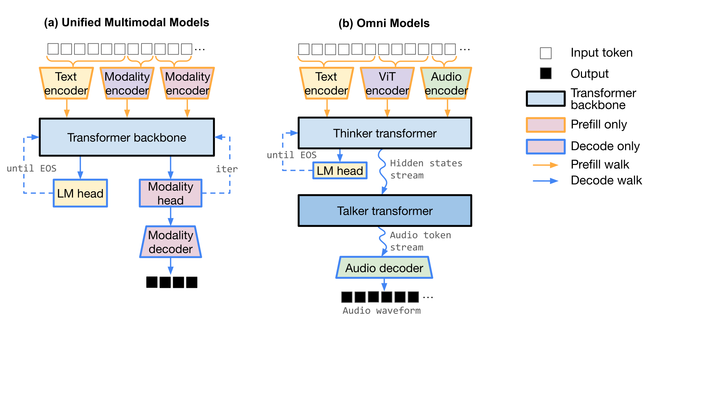
*Figure 1. Two composite architectures as graphs of components — BAGEL (a UMM: `vit_encoder`,
`vae_encoder`, an `LLM` backbone, `vae_decoder`) and Qwen3-Omni (an omni model: `Thinker`, `Talker`,
`Code2Wav`). Structurally diverse; each is naturally a graph.*

## Why today's serving stacks fall short

Composite models pose three challenges at once: **architectural diversity** (many paths, non-AR loops),
**performant modularity** (HuggingFace Transformers is flexible but slow; vLLM and VoxServe are fast but
domain-locked), and **physical topology** (heterogeneous components want different placement, batching, and
transport).

**vLLM and SGLang** are superb at autoregressive text, but they are **modality-locked**: built for text
generation, with image (and even text) inputs supported only as prefill-time encoder add-ons, and a single
decode loop whose output is always text. There is no first-class way to compose heterogeneous components
into loops and parallel branches — no CFG fan-out — and no cross-component streaming. **vLLM-Omni and
SGLang-Omni** go further, modeling a request as a flat pipeline of stages wired by explicit data-transfer
functions — enough for a Thinker–Talker–codec chain. But iteration stays inside a single stage and stages
cannot be composed in parallel, so patterns such as diffusion loops or classifier-free guidance (CFG)
fan-out must be added per-model as glue code. In vLLM-Omni, for instance, BAGEL's CFG runs through a
bespoke plugin built on `torch.distributed`.

We built M\* because we wanted to make it easier for current and future composite models to achieve
state-of-the-art efficiency. We found that current systems could be generalized into the M\* *Walk Graph*.

| | vLLM-Omni | SGLang-Omni | **M\* (ours)** |
|---|---|---|---|
| Graph node | Engine-instance stage | Worker-pool stage | **Model component** |
| Composition | Flat DAG | Flat DAG | **Seq. / Par. / Loop / Stream** |
| Paths per model | Prefill, decode | Prefill, decode | **Flexible** |
| Loops | Within a stage | Within a stage | **Across any subgraph** |
| Placement | Stage | Stage | **Component, w/ optional Walk** |

*Table 1. Each prior abstraction is a restricted subset of the Walk Graph.*

## The Walk Graph, by example

In M\*, a model is declared as a graph of model-component nodes connected by tensor edges, plus a set of
named **Walks**. Each Walk is a labeled subgraph for one phase of behavior. A request is a *series of
Walks*, chosen by a small state machine the model author writes. The author provides only the graph and the
Walks. Everything physical — placement, scheduling, batching, tensor transport, streaming — is the
runtime's job.

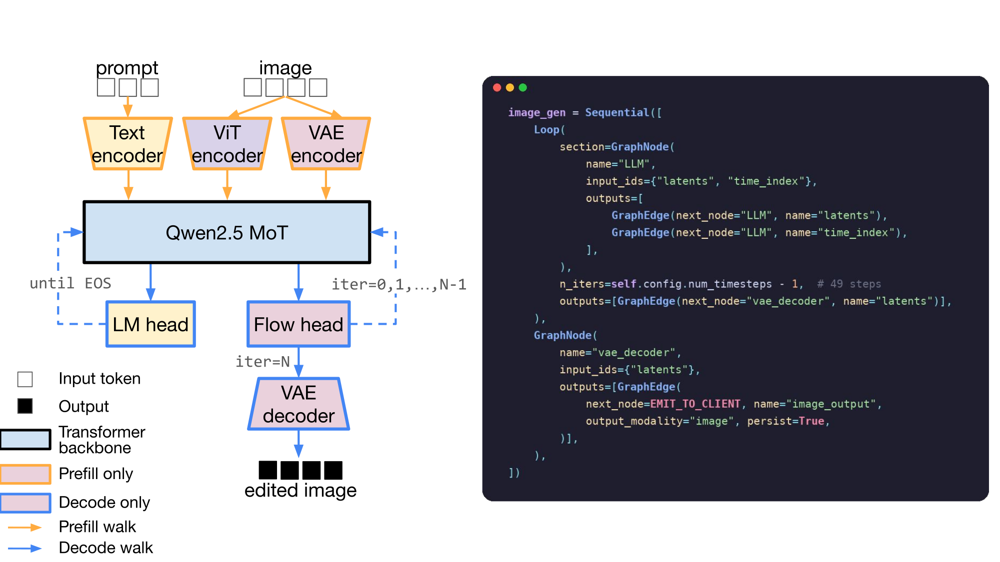
*Figure 2. BAGEL in M\*: its components as graph nodes (four core, plus `combine_cfg` and two extra `LLM`
views when CFG runs in parallel), and the Walks a request strings together.*

For example, BAGEL has four core components — `vit_encoder`, `vae_encoder`, the `LLM`, and `vae_decoder` —
and a handful of Walks. The state machine strings them together differently per request:

- **Generate an image** (text → image): `prefill_text → image_gen`
- **Understand an image** (image → text): `prefill_text → prefill_vit → decode`
- **Edit an image** (image → image): `prefill_text → prefill_vae → prefill_vit → image_gen`

Defining requests as Walks means that the runtime executes *only the components a request needs*. Image
understanding never touches the diffusion loop or the `vae_decoder`; image generation never runs the ViT
understanding path.

Walks are run based on a state machine the author writes: it builds the prefill steps from the input
modalities, then transitions to decode or image generation based on the requested output (*note: this is a
simplification of the actual M\* model code*):

```python
# Pick the next Walk based on the current phase.
def next_walk(self, state):
    if state.prefill_steps:                 # still consuming inputs
        return state.prefill_steps.pop(0)   #   prefill_text / prefill_vae / prefill_vit
    if state.target == "image":
        return "image_gen"                  #   image_gen_cfg when CFG is configured
    return "decode"                         # otherwise, autoregressive text
```

Next we'll see how the model author defines the BAGEL graph. If you would rather run it first, go to the
[quickstart](https://mstar.stanford.edu/mstar/quickstart.html).

**Start with one node.** A node names its inputs and declares where each output goes. BAGEL's `vae_decoder`
takes denoised latents and emits an image to the client:

```python
from mstar.graph.base import GraphNode, GraphEdge
from mstar.graph.special_destinations import EMIT_TO_CLIENT

vae_decoder = GraphNode(
    name="vae_decoder",
    input_names=["latents"],
    outputs=[
        GraphEdge(next_node=EMIT_TO_CLIENT, name="image_output",
                  output_modality="image"),
    ],
)
```

The graph only names inputs, outputs, and wiring. The compute behind a node is a `torch.nn.Module` — the
model author implements `prepare_inputs` and a pure-tensor `forward`, and the runtime handles batching, KV
caching, CUDA graphs, and tensor transport.

Here is that Submodule for the `vae_decoder` node:

```python
class VAEDecoderSubmodule(NodeSubmodule):      # NodeSubmodule is a torch.nn.Module
    def __init__(self, vae_model):
        self.vae_model = vae_model

    def prepare_inputs(self, graph_walk, fwd_info, inputs):
        # gather the tensors this node consumes from its input edges
        return NodeInputs(tensor_inputs={"latents": inputs["latents"][0]})

    def forward(self, graph_walk, engine_inputs, latents):
        # pure tensor compute; outputs are keyed to the node's output edges
        image = self.vae_model.decode(unpatchify(latents))
        return {"image_output": [image]}
```

**Add a loop.** BAGEL generates an image by running flow-matching steps on its `LLM` backbone, then
decoding the final latents to pixels. This can be expressed in M\* with a `Loop`, which runs its `section`
repeatedly, feeding each step's outputs back as the next step's inputs. When the loop finishes, its
`outputs` route forward — here, the latents route to the `vae_decoder` we just built:

```python
from mstar.graph.base import Sequential, Loop

image_gen = Sequential([
    Loop(
        section=GraphNode(
            name="LLM",
            input_names=["latents", "time_index"],
            outputs=[
                GraphEdge(next_node="LLM", name="latents"),
                GraphEdge(next_node="LLM", name="time_index"),
            ],
        ),
        max_iters=49,                       # num_timesteps - 1
        outputs=[GraphEdge(next_node="vae_decoder", name="latents")],
    ),
    vae_decoder,                            # the node from above
])
```

The same `Loop` primitive covers autoregressive text decode (it stops on an end-of-sequence signal instead
of a fixed count) and world-model rollout (it stops at the horizon). Nothing here is special-cased to
images. Furthermore, because Loops are generic, M\* applies continuous batching and CUDA-graph replay to
flow steps exactly as it does to token decode.

*Note:* BAGEL's diagram splits the model into a backbone, an LM head, a flow head, a time embedder — yet the
code has a single `LLM` node. That is a design choice for performance: BAGEL's flow projection and time
embedder are one or two linear layers each and both run on the same hidden states as the backbone, so M\*
keeps them inside the one `LLM` node — splitting them out would add scheduling and input-preparation
overhead on the image-generation critical path, with no performance benefit. The ViT and VAE *are* separate
nodes, because they genuinely differ in compute and placement needs.

**Add parallelism.** Classifier-free guidance (CFG) runs three forward passes per denoising step — an
unconditional pass and two conditioned ones — and combines them. Running these in parallel is ideal for
minimizing latency. Unfortunately, this kind of pattern is hard to capture in the flat stage pipelines used
by vLLM-Omni or SGLang-Omni. Because three-way CFG can't be natively supported, it requires a bespoke
per-model plugin (e.g., a `CFGParallelMixin` that `all_gather`s velocities across ranks in vLLM).

Meanwhile, M\* handles all parallelism in a generic way, so the user just needs to express the parallelism
to the runtime. This is done with a `Parallel` block of three `LLM` "views" that fan into a `combine_cfg`
node and loop. Each branch can sit on its own GPU; the runtime places and merges them with no per-model glue
code (listing lightly simplified):

```python
from mstar.graph.base import Parallel

image_gen_cfg = Sequential([
    Loop(
        section=Sequential([
            Parallel([
                GraphNode(name="LLM",          input_names=["latents", "time_index"],
                          outputs=[GraphEdge(next_node="combine_cfg", name="v_main")]),
                GraphNode(name="LLM_cfg_text", input_names=["latents", "time_index"],
                          outputs=[GraphEdge(next_node="combine_cfg", name="v_cfg_text")]),
                GraphNode(name="LLM_cfg_img",  input_names=["latents", "time_index"],
                          outputs=[GraphEdge(next_node="combine_cfg", name="v_cfg_img")]),
            ]),  # latent-init consistency ensured via a fixed per-request seed
            GraphNode(
                name="combine_cfg",
                input_names=["v_main", "v_cfg_text", "v_cfg_img", "latents", "time_index"],
                outputs=[       # feed latents + time_index back to every branch
                    GraphEdge(next_node="LLM",          name="latents"),
                    GraphEdge(next_node="LLM",          name="time_index"),
                    GraphEdge(next_node="LLM_cfg_text", name="latents"),
                    GraphEdge(next_node="LLM_cfg_text", name="time_index"),
                    GraphEdge(next_node="LLM_cfg_img",  name="latents"),
                    GraphEdge(next_node="LLM_cfg_img",  name="time_index"),
                ],
            ),
        ]),
        max_iters=49,
        outputs=[GraphEdge(next_node="vae_decoder", name="latents")],
    ),
    vae_decoder,  # as defined in "Start with one node" above
])
```

How do the three `LLM` views connect to the real model? Each node name maps to a Submodule, and the three
CFG branches are the same language model wrapped under three names, differing only in which guidance cache
they read and write.

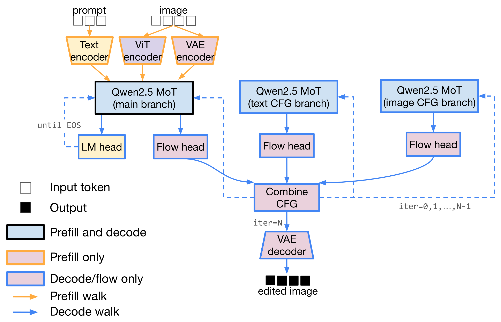
*Figure 3. BAGEL in M\* with CFG parallelism. The three Qwen2.5 MoT models are each placed on a different
GPU to enable parallel execution for each KV cache.*

**Placement.** Placement is a small YAML file that maps logical nodes to physical GPU ranks. Nothing in the
model code changes when you move components around. Mapping each node to GPU ranks — disaggregating
components, disaggregating prefill from decode, or using tensor-parallel **sharding** — always uses the same
placement API, so you can shard a big Qwen3-Omni backbone while disaggregating its encoders and codec
elsewhere.

As an example, the *same* BAGEL graph runs on one GPU:

```yaml
# Single GPU: everything colocated
model: "bagel"
node_groups:
  - { node_names: [vit_encoder, vae_encoder, vae_decoder, LLM], ranks: [0] }
```

...or fans the three CFG branches across three GPUs — active only during image generation — by editing the
same file:

```yaml
# Three GPUs: CFG branches on their own ranks, only during image_gen_cfg
model: "bagel"
node_groups:
  - { node_names: [vit_encoder, vae_encoder, vae_decoder], ranks: [0] }
  - { node_names: [LLM, combine_cfg], ranks: [0] }
  - { node_names: [LLM_cfg_text], ranks: [1], graph_walks: [image_gen_cfg] }
  - { node_names: [LLM_cfg_img],  ranks: [2], graph_walks: [image_gen_cfg] }
```

The `graph_walks` key lets you place a node differently *per Walk* — for example, prefill for a node can
happen on one GPU while decode happens on another.

### Streaming, by example: Qwen3-Omni

Some components have to overlap in time. Qwen3-Omni speaks by pipelining three components: a **Thinker**
(the LLM that produces hidden states and text), a **Talker** (an autoregressive model that turns those into
audio codec tokens), and **Code2Wav** (a code-to-waveform codec decoder). To start playing audio before the
whole response is computed, the Thinker streams one hidden state at a time to the Talker, and the Talker
streams codec frames to Code2Wav.

In M\*, streaming is a first-class edge type: the producer just marks an output as streaming to a downstream
partition, and a **chunk policy** — declared once in the model's topology and matched to the edge by name —
decides how the consumer reassembles the stream:

```python
from mstar.streaming.topology import Connection, PartitionTopology, StreamingGraphEdge
from mstar.streaming.chunk_policy import FixedChunkPolicy, LeftContextChunkPolicy

# Inside the Thinker's walk: hidden states stream to the Talker.
StreamingGraphEdge(next_node="Talker", name="thinker_states", target_partition="Talker")

# Inside the Talker's walk: codec frames stream to Code2Wav.
StreamingGraphEdge(next_node="Code2Wav", name="codec_tokens", target_partition="Code2Wav")

# How each stream is reassembled is declared once, in the model's topology:
PartitionTopology(
    partitions=["Thinker", "Talker", "Code2Wav"],
    connections=[
        Connection(from_partition="Thinker", to_partition="Talker",
                   edge_name="thinker_states",
                   chunk_policy_factory=lambda: FixedChunkPolicy(chunk_size=1,
                                                                 continue_after_done=True)),
        Connection(from_partition="Talker", to_partition="Code2Wav",
                   edge_name="codec_tokens",
                   chunk_policy_factory=lambda: LeftContextChunkPolicy(chunk=25, left_context=25)),
    ],
)
```

`FixedChunkPolicy(chunk_size=1)` feeds the Talker one Thinker state per step; `LeftContextChunkPolicy` hands
Code2Wav 25-frame chunks plus 25 frames of left context to warm up its causal convolutions. The Talker runs
as an autoregressive `Loop`; Code2Wav is re-triggered per chunk. The result is three components on three
GPUs, overlapping in time, emitting audio incrementally. The same small set of chunk policies — fixed,
sliding-window, left-context — covers every streaming edge in our models (Orpheus's SNAC decoder uses the
sliding-window one), instead of bespoke per-model streaming code.

## What the Walk Graph unlocks

Decoupling the model from the runtime is where the performance comes from:

- **Modality-aware scheduling:** run *only the components a request needs*. A Walk names exactly which parts of the model participate in a request — e.g., allowing text-only responses to bypass image-generation paths and enabling fine-grained execution patterns across diverse multimodal architectures. Because execution is defined as traversal of the model graph, these optimizations emerge from M\*'s model executor itself rather than requiring model-specific scheduling logic.
- **Reusable systems optimizations:** execution stages share a common interface, allowing techniques such as paged attention, FlashInfer kernels, `torch.compile`, and CUDA Graphs to be applied across diverse components — from standard LLM decoding to diffusion transformers and speech-generation modules — without bespoke integration work for each model architecture.
- **Flexible parallelism:** express parallelism *within a graph stage* with `Parallel` (e.g., the three CFG branches); the runtime executes all instances of parallelism uniformly.
- **Flexible placement:** map each node to GPU rank(s) to support patterns such as encoder/decoder disaggregation, prefill/decode/flow disaggregation, independent scaling of components, transparent multiplexing of one replica across requests, and tensor-parallel **sharding** of one large component across GPUs.
- **Loops are first-class:** continuous batching and CUDA-graph replay apply to any loop, so diffusion steps, world-model rollouts, and token decode all ride the same machinery — and a rollout's KV cache persists across steps instead of being recomputed.
- **Streaming is first-class:** one small set of chunk policies covers every streaming edge, as the Qwen3-Omni example showed. Streaming follows the same interface regardless of placement, with connections between colocated components requiring no communication overhead.

## Under the hood

M\* lowers the graph to a distributed runtime. A **Conductor** tracks each request's Walk and dispatches
work to per-GPU **Workers** that route tensors directly to one another. Some key features:

- **Pluggable data plane:** components exchange tensors over shared memory, RDMA, or TCP (via Mooncake), chosen by where the components are located.
- **A handful of engines:** a modality-agnostic AR engine (it also handles any node that needs a KV cache and/or sampling) with a FlashInfer paged-attention KV cache, plus a stateless engine (for, e.g., encoders, decoders, audio codecs); all support continuous batching and CUDA-graph replay.
- **Overlapped scheduling:** while the current step runs on the GPU, M\* prepares the next batch and its attention plan on a separate stream, and keeps loops moving by deferring each stop check by one iteration. This is implemented generically over the `Loop` primitive — not just for text or speculative decoding — so the GPU rarely stalls on CPU scheduling.
- **Sharding × disaggregation:** tensor-parallel sharding (parallel linears, vocab-parallel embeddings, sharded MoE and KV cache, NCCL collectives) is built in and set with a `tp_size` in the placement file, so one large component doesn't have to fit on one GPU.

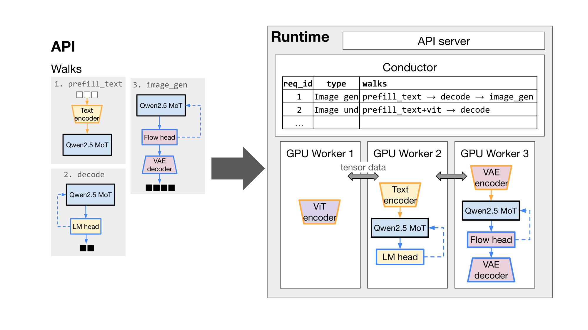
*Figure 4. M\* at a glance: the author defines a computation graph and a set of Walks; the runtime places
component subgraphs onto GPU workers per a user-specified placement.*

## Does it work? — Matching or beating specialized systems

We instantiate M\* on five real models and compare against the strongest specialized baseline for each.

| Model · task | Baseline(s) | Setup | Speedup over baseline |
|---|---|---|---|
| BAGEL · text→image | vLLM-Omni | 3×H100, CFG-parallel, B=1 | ≈1.3× lower latency |
| BAGEL · image editing | vLLM-Omni | 3×H100, CFG-parallel, B=1 | up to 2.6× lower latency |
| BAGEL · image→text | vLLM-Omni | 1×H100, B≤16 | ≈1.6× faster first token |
| Qwen3-Omni · TTS | vLLM-Omni, SGLang-Omni | 2×H200 | ≈2.7× higher throughput vs vLLM-Omni @ B=16 (≈4× vs SGLang) |
| Qwen3-Omni · TTS (TP-2 thinker) | SGLang-Omni | 2×H200, Thinker sharded | ≈3.8× higher throughput @ B=16 |
| Orpheus · TTS | VoxServe | 1×H200 | ≈1.3× higher throughput @ B=8 and lower RTF |
| V-JEPA 2 · rollout | Meta native | 1×H100 | up to 12.5× faster |

*Table 2. Five models, five specialized baselines — M\* matches or beats each. Benchmarks as of June 2026.*

The wins come from the abstraction. For image generation and editing (Figure 5), M\* runs BAGEL's three-way
classifier-free guidance as a `Parallel` block spread across three GPUs, and finishes faster than every
vLLM-Omni configuration: about 1.3× lower end-to-end latency on text-to-image, and up to 2.6× on image
editing versus vLLM-Omni's default pipeline. Against vLLM-Omni's best-tuned single-stage configuration, the
editing margin is about 1.2×.

**What is vLLM-Omni's "single-stage" config?** By default, vLLM-Omni runs BAGEL as two stages — a Thinker
(text and understanding, on vLLM's autoregressive engine) feeding a separate DiT stage for image
generation, with the conditioning KV cache shipped between them. The single-stage config collapses the
whole model — LLM, ViT, VAE, and DiT — into one diffusion process, eliminating that cross-stage transfer:
it matches the default on text-to-image (where the transferred text conditioning is small) but is much
faster on editing (where the conditioning includes an encoded image). The catch is that text and
understanding then run *inside the diffusion engine* rather than vLLM's AR engine, giving up continuous
batching, token streaming, and paged-attention KV management — a whole-model choice that speeds up editing
at the expense of the text path. M\* needs no such bargain: because a Walk names exactly the components a
request uses, image-generation and understanding requests each execute the right way, with the engine
optimizations intact.

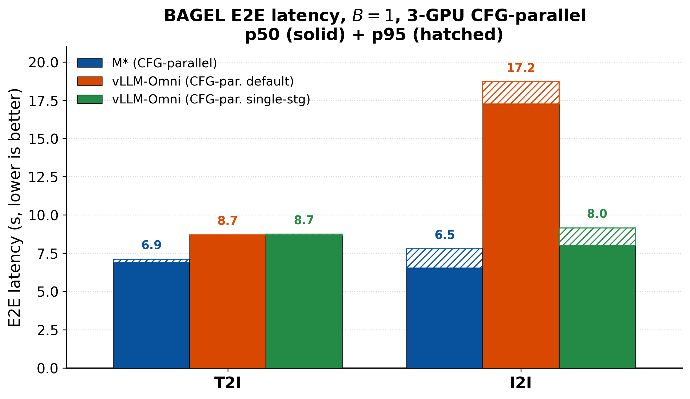
*Figure 5. BAGEL image generation and editing. 3×H100, CFG-parallel, B=1; lower is better.*

Image understanding is more nuanced (Figures 6 to 8). Because a Walk names exactly the components a request
touches, an image-to-text request never runs the diffusion path, so M\* returns the first token about 1.6×
faster than vLLM-Omni and holds a throughput lead that grows with batch size, reaching about 46% for short
outputs. The cost is a slightly higher median inter-token latency, roughly 1 to 3 ms. M\*'s advantage is
therefore largest under load and for shorter responses, and narrows to near-parity for long outputs at low
concurrency.

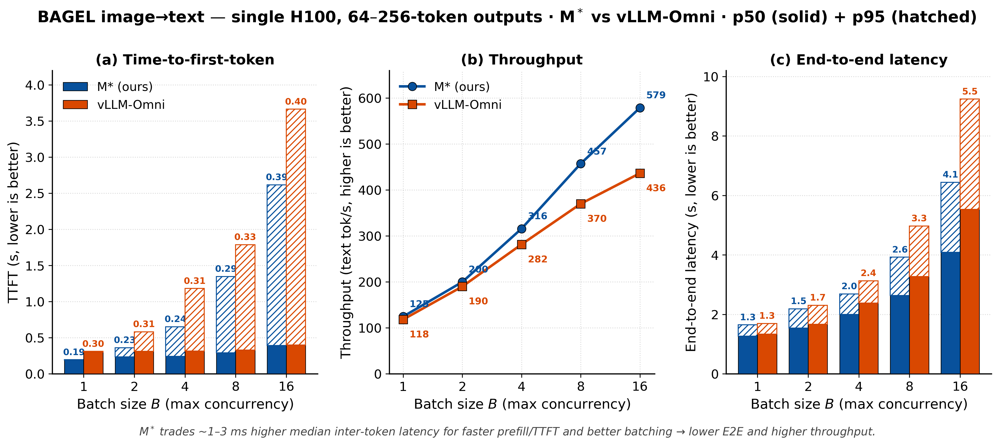
*Figure 6. BAGEL image→text, mid-length outputs (64–256 tokens), single H100.*

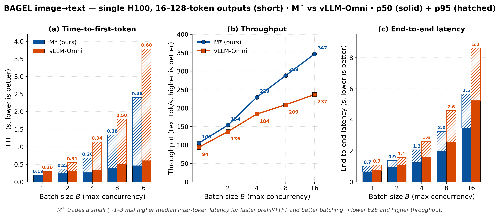
*Figure 7. BAGEL image→text, short outputs (16–128 tokens).*

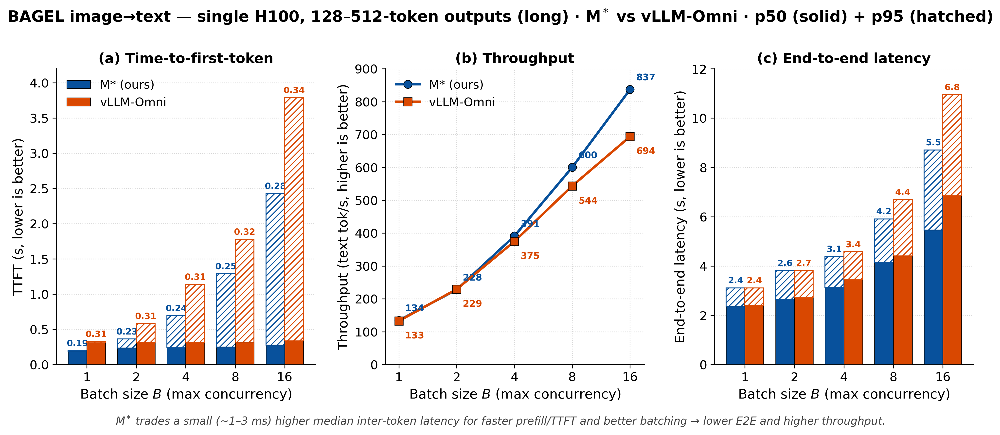
*Figure 8. BAGEL image→text, long outputs (128–512 tokens).*

Speech and omni models follow the same pattern (Figures 9 to 11). On Qwen3-Omni text-to-speech, M\* sustains
about 2.7× the throughput of vLLM-Omni and about 4× that of SGLang-Omni, and it stays real-time through
batch size 32, where SGLang-Omni's tail latency runs past the real-time threshold. Sharding the Thinker
across two GPUs keeps about a 3.8× throughput lead, an example of sharding and disaggregation working
together. On Orpheus, M\* posts a lower real-time factor and higher audio throughput than VoxServe at every
batch size we benchmarked.

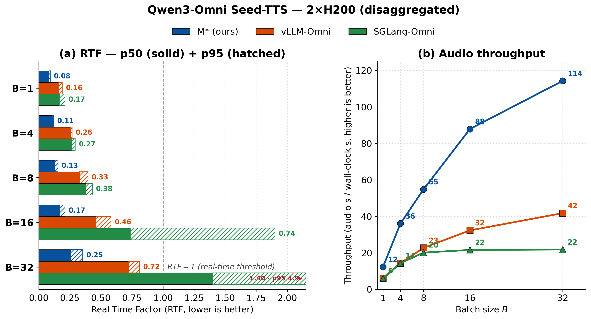
*Figure 9. Qwen3-Omni text-to-speech, 2×H200.*

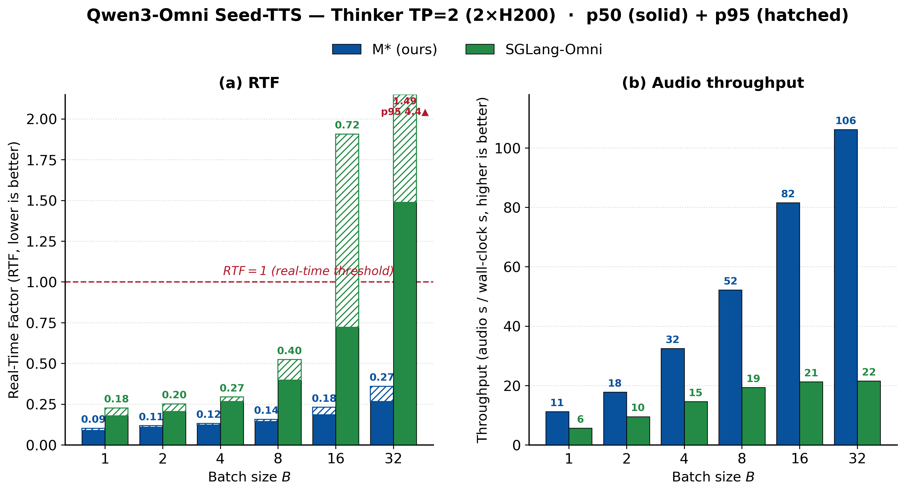
*Figure 10. Qwen3-Omni with a tensor-parallel Thinker, 2×H200.*

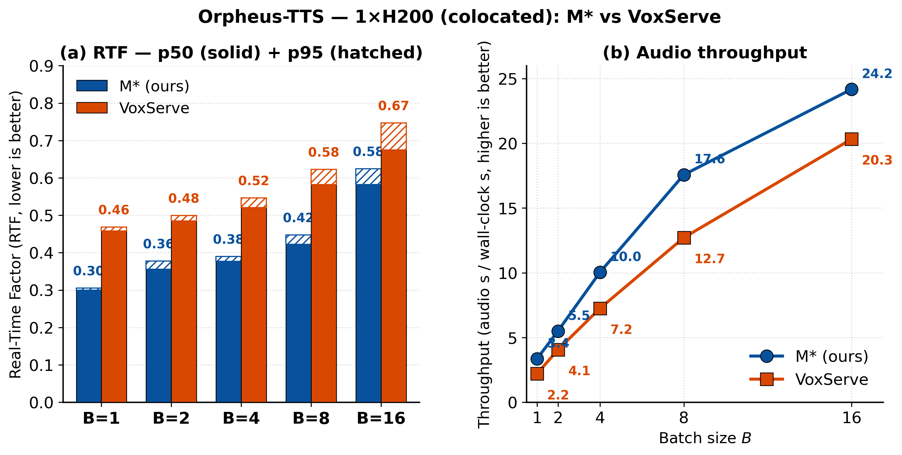
*Figure 11. Orpheus text-to-speech, 1×H200, vs VoxServe.*

World models show what first-class loops buy (Figure 12). M\* expresses the rollout as a `Loop` with a
persistent KV cache instead of recomputing it from scratch each step, which yields up to 12.5× over Meta's
native rollout.

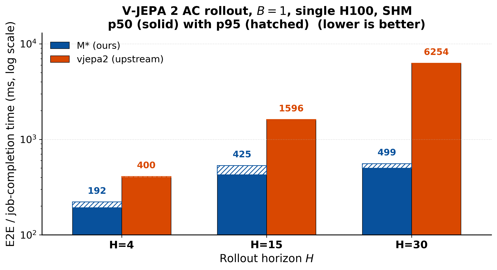
*Figure 12. V-JEPA 2-AC rollout, 1×H100, horizons 4/15/30.*

## Coming soon

- **More models, coming soon:** more omni models (Ming-flash-omni-2.0, Qwen2.5-Omni), world models (Cosmos 3), and more VLAs — among others. Want a model supported? [Get in touch](mailto:atindra@cs.stanford.edu) or [open a GitHub issue](https://github.com/mstar-project/mstar/issues).
- **More parallelism, everywhere:** tensor-parallel sharding is live and rolling out across model families; sequence/context and DiT-specific parallelism are coming soon.
- **Unified engine plugins:** converging the AR, encoder/decoder, and audio-codec engines behind one interface.

## What's next

The bigger picture the Walk Graph opens up — three directions we are actively pursuing:

- **SLO-aware placement and path-aware autoscaling:** search automatically for a node-and-Walk → worker placement that meets an objective (throughput, latency, or cost), and rescale to the live traffic mix — scale up only the components on hot Walks, and offload cold ones to host memory off the critical path.
- **An agentic serving layer:** an agent is itself a graph over model calls, the same shape M\* runs inside one model; we are building a layer that places the inter-model agent graph and the intra-model component graph under one runtime, so calls across many agents share scheduling, placement, batching, and cached state.
- **A compiler for the Walk Graph:** treated as an IR, the graph enables graph-level optimization (eliminating components a request never touches, fusing operations, scheduling the overlap above) and mapping each component to the hardware it runs best on.

## Get the code

**Try it:** install M\*, point it at a model with a placement config, and serve in one command (see the
[quickstart](https://mstar.stanford.edu/mstar/quickstart.html)). We'd love your feedback: open a [GitHub issue](https://github.com/mstar-project/mstar/issues), or email
[atindra@cs.stanford.edu](mailto:atindra@cs.stanford.edu). If there's a model you'd like to see supported,
tell us.

M\* is open source. If you build on this work, please cite it:

**[Read the paper (arXiv)](https://arxiv.org/abs/2606.12688) · [Code (GitHub)](https://github.com/mstar-project/mstar) · [Docs](https://mstar.stanford.edu/mstar/)**

```bibtex
@article{mstar2026,
  title     = {M*: A Modular, Extensible, Serving System for Multimodal Models},
  author    = {Atindra Jha and Naomi Sagan and Keisuke Kamahori and Irmak Sivgin and
               Rohan Sanda and Steven Gao and Mark Horowitz and Luke Zettlemoyer and
               Olivia Hsu and Jure Leskovec and Baris Kasikci and Stephanie Wang},
  year      = {2026},
  eprint    = {2606.12688},
  archivePrefix = {arXiv},
  primaryClass = {cs.LG}
}
```
